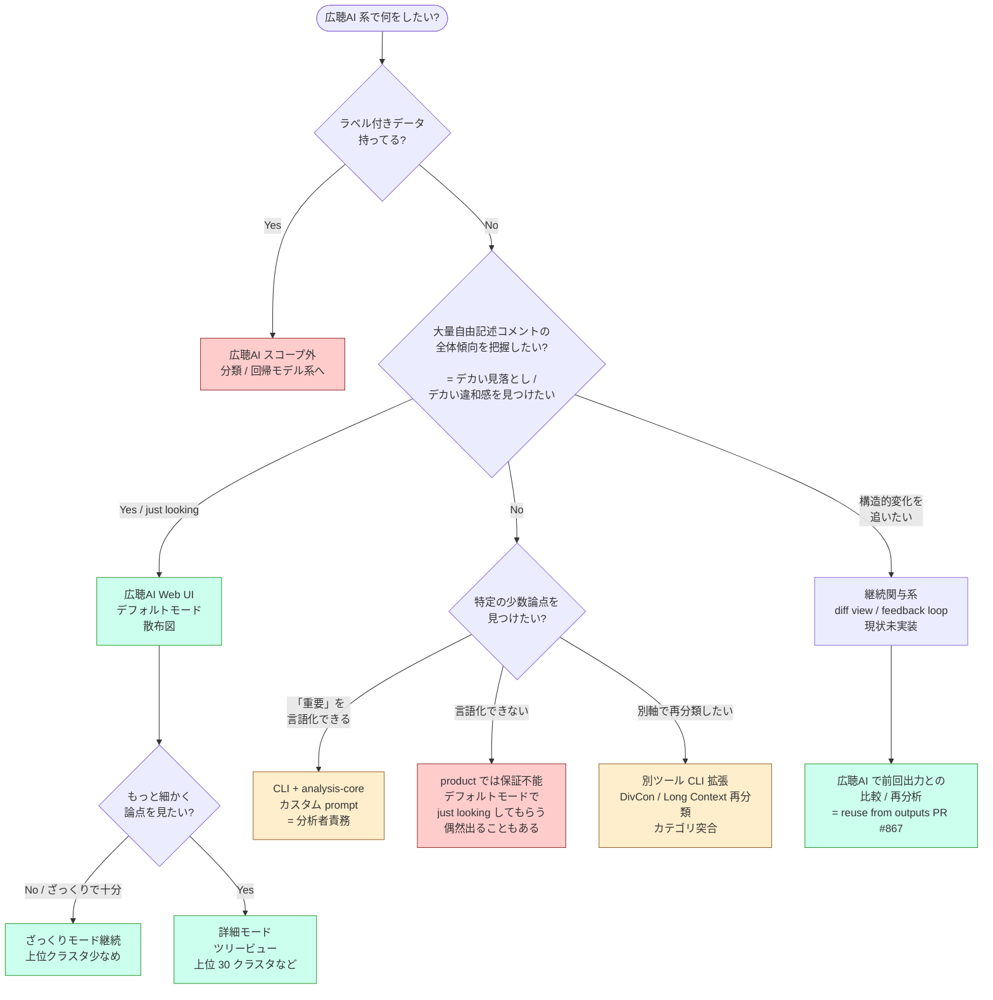
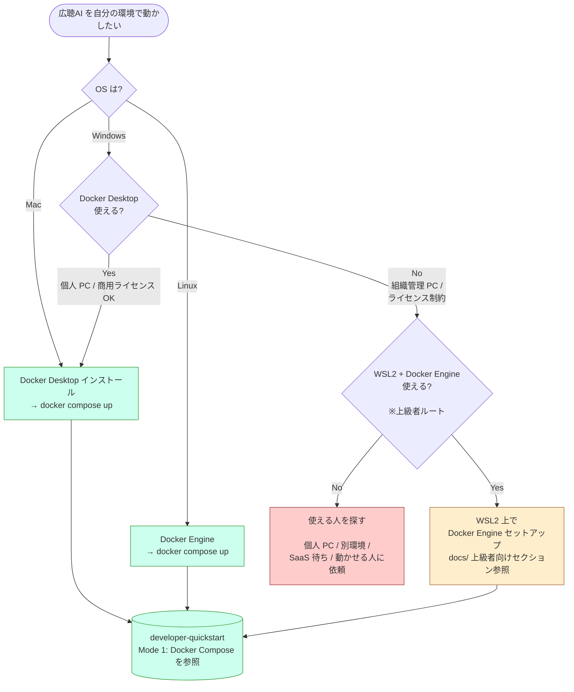

2026-05-30 の Slack で tokoroten が [scikit-learn の estimator 選択チャート](https://scikit-learn.org/1.3/tutorial/machine_learning_map/) を引いて「この手の図を作りますか？」と提案し、ohki-shingo は「開発時に『どの目的に対して、どの分析手法・表示を使うのか』を共有するのによさそう」と賛同、nishio は「むしろ環境構築にこういう図があるといいのかも」と別案を出した。[[slack-stance-discussion-2026-05-30]]より

本ページは両方を Mermaid で試作し、見比べてどちらをどこで使うかを検討する材料にする。

## 試作 A: ユースケース分岐 (開発時の共有材料 / 機能カタログ)

[[analysis-stance]] と [[broadlistening-tool-ecosystem-vision]] で整理した契約と分業を、scikit-learn 風のフローに落とす。読者は開発者 / エコシステム設計に関わる人。**ユーザに直接出す UI ではない**。

**色分け**: 緑 = 広聴AI Web UI 本体、橙 = CLI / 別ツール (分析者領域)、赤 = スコープ外 / product 保証なし

### 読み筋

- 緑 (Web UI) は contract A pure の領域。一般ユーザはここに収まる
- 橙 (CLI / 別ツール) はデータサイエンス素養を持つ分析者の領域。エコシステム拡張の場所
- 赤 (スコープ外) を率直に書くことで、「ラベル付き分類はやらない」「重要の言語化抜きの少数論点発見は保証しない」を docs / 開発議論で明示できる
- scikit-learn の図が「データ50件ない？もっと集めてこい」と書いているのと同じノリで、「言語化できない？just looking でデフォルトを見て」と書ける

## 試作 B: 環境構築 (導入導線)

nishio の「Mac or Linux? No → Docker Desktop 使える？No → 使える人を探せ」案 ([[slack-stance-discussion-2026-05-30]]) を、`#877` ([[issue-877-windows-setup-guide-scope]]) と Docker Desktop ライセンス制約 ([[docker-desktop-license-2026-05-29]]) を踏まえて書く。

**色分け**: 緑 = 標準サポート経路、橙 = 上級者ルート、赤 = サポート境界外 (人を探す / 別経路)

### 読み筋

- 標準ルートは Mac / Linux / Docker Desktop が使える Windows の 3 経路に集約
- WSL2 + Docker Engine は明示的に上級者ルート (= beginner guide の対象外)
- 「使える人を探せ」を素直に書くことで、サポート境界の存在を docs として認知させる
- developer-quickstart `#883` の Mode 1 に直結させると、フロー後の具体手順を 1 画面で完結できる

## 比較 — どっちをどこで使うか

| 観点 | 試作 A (ユースケース分岐) | 試作 B (環境構築) |
|---|---|---|
| 想定読者 | 開発者 / contributor / エコシステム設計議論 | 導入したい個人 / 自治体担当 |
| 表示場所 | 開発 docs / wiki / 設計議論資料 (ユーザ UI 化 ✗) | developer-quickstart 冒頭 / README 冒頭 |
| 効果 | 機能カタログ + 境界明示 (スコープ外を率直に書ける) | 「環境用意できない → 人を探す」を明示し導入相談を減らす |
| 関連判断 | [[analysis-stance]] / [[broadlistening-tool-ecosystem-vision]] | [[issue-877-windows-setup-guide-scope]] / [[docker-desktop-license-2026-05-29]] |
| 実装コスト | Mermaid を docs サイトに乗せる程度 | 同じ。`PR #883` (developer-quickstart) に取り込み候補 |

両方とも有用で、用途が違うので排他ではない。試作 A は wiki / 開発議論用、試作 B は ユーザ向け docs 用、と棲み分けるのが自然。

## 試作 A の検討事項 (詰めたい論点)

- 「継続関与系」を分岐に含めたのは現状 product 機能としてはまだ薄い。位置づけを将来候補として残すか、削るか
- 「別軸で再分類したい → DivCon / Long Context 再分類」は CLI 拡張だが、別ツールの存在を前提にしている。エコシステム整備 ([[broadlistening-tool-ecosystem-vision]]) より早くフローに書くべきか
- 「Yes / just looking」「言語化できない」のような注釈は、scikit-learn 図の率直さを再現しているが、product 公式図としてはトーン調整が要るかも
- 散布図 / 詳細モードの切替を Yes/No で書いたが、実際には事後誘導型 ([[analysis-stance]] UX 指針) なので、フロー上の表現と UX 実装は別物として整理が要る

## 試作 B の検討事項

- WSL2 ルートを「上級者向け」として残すか、もっとシンプルに「Docker Desktop なら OK、それ以外は人を探せ」で止めるか (nishio の元案は後者寄り)
- 「使える人を探す」の到達先を、SaaS ホスト型待ち / コミュニティ Slack / discord などへ具体化するか
- developer-quickstart `#883` に取り込む場合、現行 4 モード分岐 (Docker Compose / dummy-server + frontend / native / CLI) との順序関係をどう整理するか (環境構築フローが先、4 モード分岐は Mode 1 内訳、という階層化が筋)

## Open Questions

- Mermaid を MkDocs / Quartz で正しくレンダリングできるか確認していない (試作段階)
- 試作 A を docs に乗せるとして、誰がメンテするか (`analysis-stance` の派生図として保つ?)
- 試作 B の図を `#883` PR に追加 PR として乗せるか、別 PR として切るか

## Updates

- 2026-05-30: 初版。Slack で tokoroten が scikit-learn estimator チャートを引いた提案を受け、ユースケース分岐版と環境構築版の 2 種類を Mermaid で試作した。両方とも草稿、どこに正本化するかは検討中
