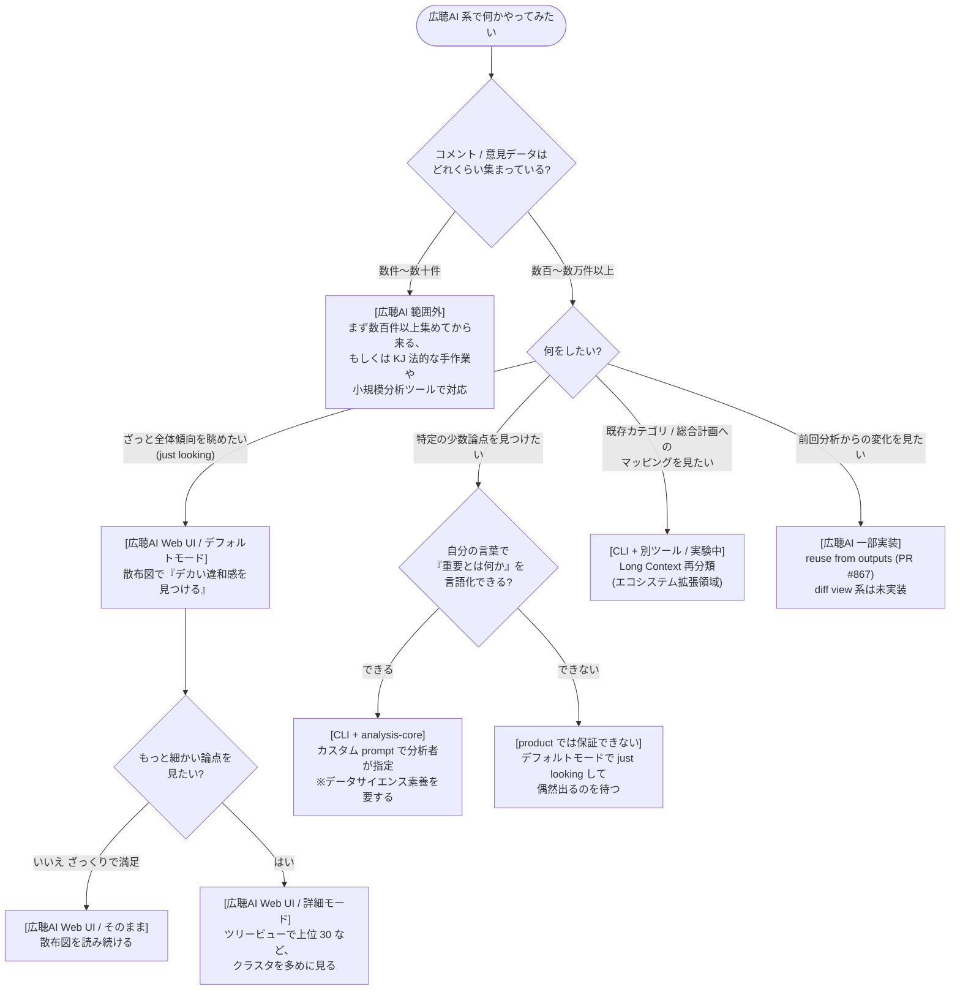
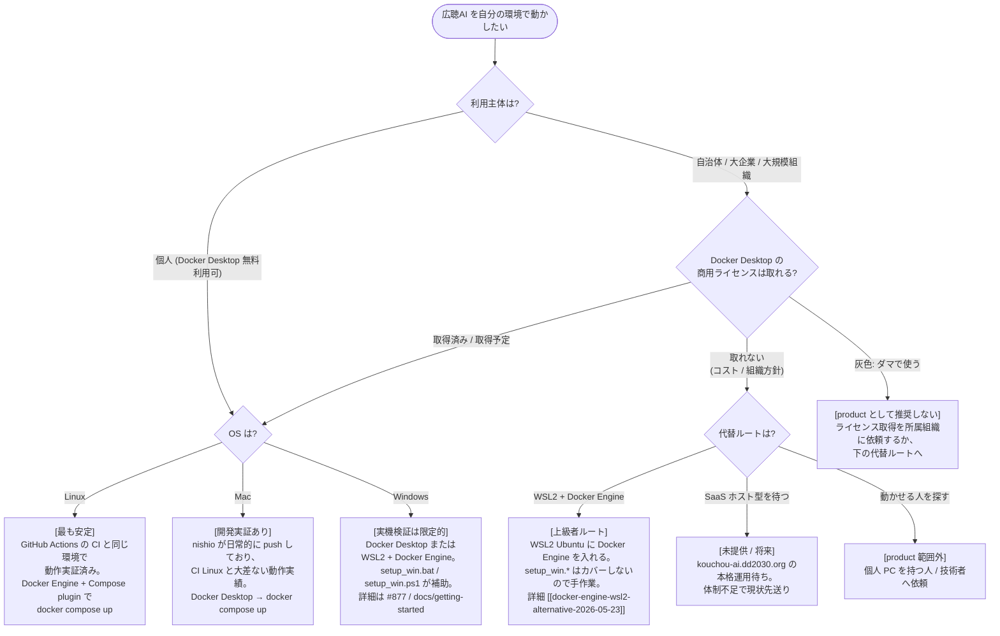

2026-05-30 の Slack で tokoroten が [scikit-learn の estimator 選択チャート](https://scikit-learn.org/1.3/tutorial/machine_learning_map/) を引いて「この手の図を作りますか？」と提案し、ohki-shingo は「開発時に『どの目的に対して、どの分析手法・表示を使うのか』を共有するのによさそう」と賛同、nishio は「むしろ環境構築にこういう図があるといいのかも」と別案を出した。[[slack-stance-discussion-2026-05-30]]より

本ページは両方を Mermaid で試作する。初版を出した直後に team feedback ([[slack-flowchart-feedback-2026-05-30]]) で前提誤りが指摘されたため、現在版は修正後の v2。

## 設計原則

- **ノードの意味区分 (本体 / CLI / スコープ外 など) は背景色ではなく、ノード本文中の `[ラベル]` で明示する**。ダークモード / 色覚特性で背景色が読めないため。Mermaid `classDef` で色だけ違う class 分けはやらない
- 一般読者を対象にするフローでは「ラベル付きデータ」のような jargon を使わない
- 「product として保証できないこと」「スコープ外」は scikit-learn の率直さ (「データ50件ない？もっと集めてこい」) を真似て、率直に書く

## 試作 A v2: ユースケース分岐 (開発時の共有材料 / 機能カタログ)

`(やりたいこと) → どの広聴AI 機能 / 別ツール` のフロー。読者は開発者 / エコシステム設計に関わる人。

### 読み筋

- 最初の分岐は **データ量**。広聴AI 系の出発点はそもそも「数百件以上のデータがあること」で、それ未満は別経路に倒す
- 二段目以降は [[analysis-stance]] / [[broadlistening-tool-ecosystem-vision]] が整理した分担と直結する: 全体傾向は Web UI、少数論点は CLI 分析者責務、既存カテゴリマッピングは別ツール、継続関与は一部実装
- 「`[product では保証できない]` デフォルトモードで just looking して偶然出るのを待つ」のように、product 境界を率直に書く。scikit-learn の「データ50件ない？もっと集めてこい」のノリ

### v1 からの修正履歴

- v1 の最初の分岐「ラベル付きデータ持ってる?」は誤り。広聴AI 系で先に判断すべきはデータ量。さらに「ラベル付きデータ」は jargon で一般読者には伝わらない (tokoroten 指摘)
- 意味区分は v1 の `classDef` 色分けから、ノード本文中の `[ラベル]` 表記に置き換え

## 試作 B v2: 環境構築

`#877` ([[issue-877-windows-setup-guide-scope]]) と Docker Desktop ライセンス制約 ([[docker-desktop-license-2026-05-29]]) を踏まえ、利用主体 (個人 / 大組織) と OS を 2 段で扱う。

### 読み筋

- 最初の分岐は OS ではなく **利用主体 (個人 / 大組織)**。Docker Desktop のライセンスが個人無料 / 大規模組織有料で大きく分かれるため (nishio: 「個人で試すのは無料、自治体は有料、って話が抜けてるんだな」)
- OS 軸では platform 安定性ティアを明示: **Linux > Mac > Windows**。理由は (1) CI が Linux で回って tests pass、(2) nishio が Mac で開発・push しているので Mac は CI Linux と大差ない動作実績、(3) Windows は実機検証が限定的
- 「ダマで使う」灰色運用 (tokoroten: 「デカい組織で使うと有料」「ダマで使ってる組織は無限にあるが、それを勧めるわけにもいかん」) は **product として推奨しない** と率直に書く
- 代替ルート (WSL2 / SaaS 待ち / 動かせる人を探す) を独立分岐として明示し、scikit-learn の「使える人を探せ」相当の率直さを残す

### v1 からの修正履歴

- v1 は OS を最初の分岐に置いたが、「Mac だから Docker Desktop インストール可能」は飛躍 (組織問題、tokoroten 指摘)。v2 では利用主体を最初に置き直し
- v1 は Linux / Mac / Windows を等価に扱ったが、実際は CI 実証と開発実証の 2 軸で安定性が大きく違う (nishio 指摘)。v2 で platform 安定性ティアを明示
- v1 は Docker Desktop の license aspect を Windows 経路だけに紐付けていたが、大組織は OS と独立にライセンス確認が要る。v2 で利用主体軸へ移動
- 意味区分は v1 の `classDef` 色分けから、ノード本文中の `[ラベル]` 表記に置き換え
- nishio コメント「AI も正しいフローチャートをかけないくらい把握できてないってことか」は、wiki に platform 安定性ティアや Docker Desktop の決定フロー上の重みが書かれていなかったことを反映。修正後は [[slack-flowchart-feedback-2026-05-30]] / [[docker-desktop-license-2026-05-29]] に知識を fix した

## 用途棲み分け (v2 でも変わらず)

| 試作 | 想定読者 | 表示場所 |
|---|---|---|
| A ユースケース分岐 | 開発者 / contributor / 設計議論 | 開発 docs / wiki (ユーザ UI 化 ✗) |
| B 環境構築 | 導入したい個人 / 自治体担当 | `developer-quickstart` 冒頭 / README 冒頭 |

両方とも有用で用途が違うので排他ではない。

## 検討事項

### 試作 A について

- 「継続関与系」を分岐に残したが、現状 product 機能としては薄い (reuse from outputs のみ)。将来候補として残すか削るか
- 「既存カテゴリへのマッピング」は CLI 拡張 / 別ツール枠だが、エコシステム整備 ([[broadlistening-tool-ecosystem-vision]]) が先か、フローに書くのが先か
- 「ざっくりモード / 詳細モード」の切替は実装としては事後誘導型 ([[analysis-stance]] UX 指針) なので、フロー上の表現と UX 実装のズレを docs にどう書くか

### 試作 B について

- WSL2 ルートを上級者向けとして書いたが、`setup_win.*` がカバーしていないため事実上 docs と乖離する。`docs/getting-started` 側の整理と同期が必要
- 「動かせる人を探す」の到達先 (SaaS ホスト型 / コミュニティ Slack / 知り合い) を具体化するか、scikit-learn 図のように突き放しの一行で済ますか
- developer-quickstart `#883` に取り込む場合、現行 4 モード分岐 (Docker Compose / dummy-server + frontend / native / CLI) との順序関係をどう整理するか (環境構築フローが先、4 モード分岐は Mode 1 内訳、という階層化が筋)

## Open Questions

- Mermaid が Quartz / MkDocs で正しくレンダリングされるかは未確認 (試作段階)
- 試作 A の正本化先 (analysis-stance の派生図 / broadlistening-tool-ecosystem-vision の付録 / 単独ページ?)
- 試作 B を `#883` PR に追加 PR として乗せるか、別 PR として切るか
- 「ダマでの Docker Desktop 利用」の灰色領域を product docs にどう書くか (率直に書くと信頼に響く / 隠すと自治体で詰まる)

## Updates

- 2026-05-30: v2 へ修正。試作 A の最初の分岐を「データ量」へ変更、「ラベル付きデータ」jargon を排除。試作 B を利用主体 (個人 / 大組織) を最初の分岐に置き直し、platform 安定性ティア (Linux > Mac > Windows) を明示、Docker Desktop license の灰色領域も率直に書いた。意味区分は背景色から `[ラベル]` テキスト表記へ置換。team feedback と修正経緯は [[slack-flowchart-feedback-2026-05-30]] に
- 2026-05-30: 初版 (v1)。Slack で tokoroten が scikit-learn estimator チャートを引いた提案を受け、ユースケース分岐版と環境構築版の 2 種類を Mermaid で試作した
